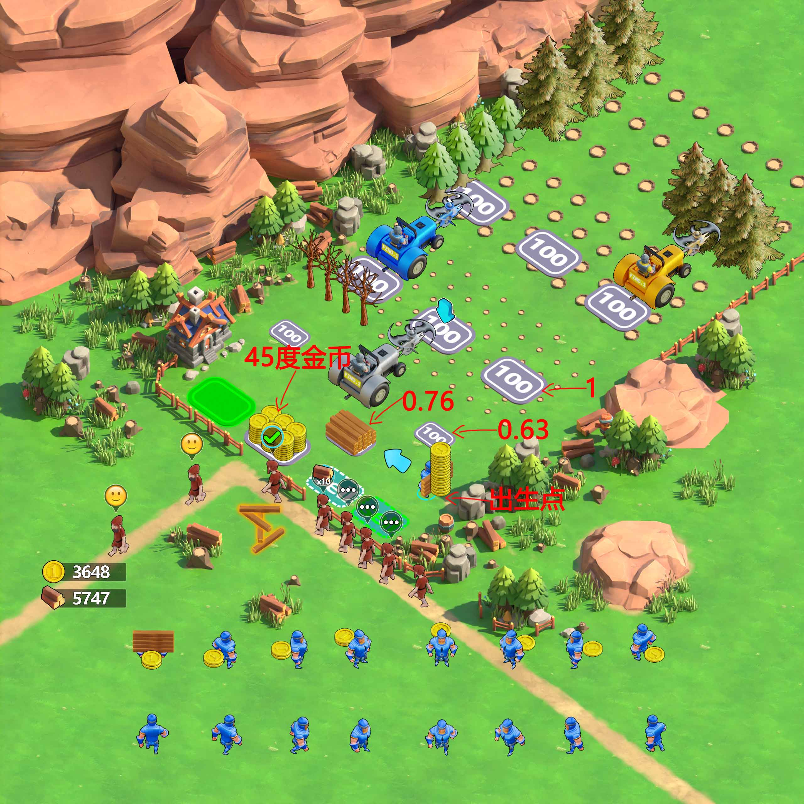

# PlaytestDemo

## 项目简介

`PlaytestDemo` 是一个基于 **Cocos Creator 3.8.7** 开发的可试玩广告游戏原型，主要使用 **TypeScript** 编写。项目围绕“拾取木头 -> 交付 NPC -> 获得金币 -> 解锁车辆 -> 车辆自动砍树 -> 收集掉落 -> 升级车辆 -> 结束引导”的核心闭环，完成了移动控制、资源拾取、NPC 交易、车辆生成与升级、树木批量生成、掉落堆叠、导航引导和结算弹窗等功能。

项目中使用到的工具和能力：

- 游戏引擎：Cocos Creator 3.8.7
- 开发语言：TypeScript
- 资源组织：Cocos `resources` 动态加载
- 动画表现：逐帧 Sprite 动画、Tween 飞行/弹出/呼吸动画
- 音频反馈：AudioSource 背景音乐与操作音效
- 主要使用的 Cocos 能力：Prefab、Inspector 参数配置、UITransform、Sprite、Label、Tween、AudioSource、节点层级管理

## 项目做了什么

- 实现了完整的可试玩广告流程，包括 Loading、开始面板、试玩过程、顶部资源计数、Play Now 按钮和结束弹窗。
- 实现了玩家移动、摇杆控制、相机跟随和人物脚下蓝色光圈，保证角色位置反馈更清晰。
- 实现了起点木头拾取和砍树掉落木头拾取，支持区域触发、半径判断、飞向玩家和角色携带表现。
- 实现了 NPC 交易流程，玩家交付指定数量木头后，NPC 离场并在金币区域生成金币。
- 实现了金币拾取逻辑，金币会从 NPC 位置飞入金币平台，玩家进入金币区域后再飞向角色并计入金币数量。
- 实现了车辆生成点、升级点和售卖点等地面交互区域，支持位置、大小、触发范围和高亮状态调整。
- 实现了车辆解锁和升级逻辑，金币可用于解锁多辆伐木车，并将车辆从 1 级升级到 3 级。
- 实现了车辆自动砍树逻辑，车辆会沿路线寻找可砍树木；遇到等级不足的树时，会触发等待、提示和受阻反馈。
- 实现了树木按等级批量生成，支持不同等级树木的行数、间隔、Prefab 和掉落数量配置。
- 实现了金币堆叠、起点木头堆叠、角色携带堆叠，以及车辆砍树后掉落木头的堆叠表现。
- 实现了砍树掉落木头动画，木头从树的位置弹出、飞到车后方堆叠点，并在落地后切换成静态木头表现。
- 实现了 NPC 头顶状态气泡，支持等待、需求进度、完成打勾和离场笑脸等阶段反馈。
- 实现了蓝色导航箭头，根据当前任务阶段自动指向木头、售卖点、金币区、车辆生成点、升级点或掉落木头。
- 实现了最终结束逻辑，所有车辆完成最终升级后触发结束界面，引导玩家进入下载/跳转行为。

## 怎么做的

项目核心代码位于 `assets/scripts`：

- `PlayableAdGame.ts`：游戏主入口和系统组装中心，集中暴露可调参数，并负责把各个子系统串成完整流程。
- `GamePreloadSystem.ts`：预加载图片、序列帧和音频资源，避免运行时频繁加载造成卡顿。
- `GameSceneBuildSystem.ts`：统一构建游戏场景，包括世界层、角色层、UI、控制器、初始木头和背景音乐。
- `WorldSceneBuilder.ts`：创建起点、售卖点、金币点、车辆生成点和升级点，并注册对应触发区域。
- `InteractionZoneSystem.ts`：负责所有地面区域的触发判断，支持圆形半径判断和节点边界判断。
- `GameplayFlowSystem.ts`：每帧检查玩家与各交互区域的关系，驱动拾取、售卖、金币收集、车辆解锁、升级和结算。
- `GameplayActionSystem.ts`：执行具体游戏动作，例如拾取木头、卖出木头、收金币、砍树、扣金币和升级车辆。
- `TreeRouteLayoutSystem.ts`：按路线方向、行列数量、树木间隔和等级行数批量生成树木，并同步车辆与升级点位置。
- `TreeSystem.ts`：管理树木等级、存活状态、树桩切换、阻挡体和砍树失败时的树木晃动。
- `CarSystem.ts`：管理车辆解锁、升级、寻路砍树、等级阻挡、失败动画、升级点显示和多车工作状态。
- `TreeWoodDropSystem.ts`：管理砍树后掉落木头的飞行动画、落点、堆叠槽位、层级和排序。
- `WoodCollectionSystem.ts`：管理起点木头和掉落木头的可拾取状态、拾取半径、堆叠位置和引导目标。
- `CoinPlaneSystem.ts`：管理金币生成、飞入金币平台、平台堆叠、拾取清空和金币排序。
- `NpcFlowSystem.ts`、`NpcQueueSystem.ts`、`NpcTradeService.ts`、`NpcVisualController.ts`：管理 NPC 排队、补位、交付进度、离场、金币产出和头顶状态。
- `GuideSystem.ts`、`GuideCoordinator.ts`：管理蓝色导航箭头的出现时机、目标选择、玩家方向箭头、目标箭头和浮动表现。
- `ActorSortSystem.ts`、`GameLayerSystem.ts`：管理世界层、角色层、UI 层、弹窗层，以及角色、树木、车辆、木头、金币和光圈的显示层级。
- `AudioService.ts`：统一播放背景音乐和操作音效，并提高关键反馈音量。

运行时会先预加载资源，然后构建世界、角色、UI 和弹窗层。开始试玩后，`GameplayFlowSystem` 持续判断玩家是否进入各类交互区域，再由 `GameplayActionSystem` 调用对应动作系统，完成拾取、交易、砍树、堆叠、升级和结束流程。

## 重点实现

### 1. 地面交互区域统一管理

项目把起点、售卖点、金币点、车辆生成点和升级点都抽象成可注册的交互区域。普通区域使用半径判断，售卖区等需要更精确的区域可以使用节点边界判断；玩家售卖时还会取脚底中心和左右脚点来判断，避免角色身体碰到区域边缘就误触发。

车辆生成点和升级点由运行时统一生成或复用场景节点，支持调整位置、尺寸、缩放和费用文字。额外车辆生成点支持独立偏移参数，方便在不同树木路线布局下快速对齐。费用文字采用更醒目的倾斜加粗表达，让“需要多少金币”在试玩中更容易被看见。

### 2. 木头和金币拾取闭环

木头分为起点木头和砍树掉落木头：起点木头跟随起点区域判断，砍树掉落木头使用独立拾取半径判断。玩家进入可拾取范围后，木头会逐个飞向玩家，并更新角色携带和 HUD 数字。

金币由 NPC 完成交易后生成，先从 NPC 位置飞到金币平台，再在平台内形成堆叠。玩家进入金币区域后，平台金币会飞向玩家并转为金币数量。这让“交付 -> 掉钱 -> 拾钱 -> 升级”的反馈链路更明确。

### 3. 堆叠表现和层级排序

金币平台使用列、行、间距和层高计算堆叠槽位，每枚金币都会落到当前高度较低的槽位，生成后按槽位和层数排序。这样金币越多，平台越像真实堆起来的金币堆。

木头也使用同样的堆叠思路。起点木头会按配置排列，玩家携带木头和金币会根据方向调整位置；车辆砍树后掉落的木头会按车辆和树木等级建立独立木头堆，支持多行、多列、层高、随机偏移和方向变体，避免所有木头重叠在一起。

### 4. 车辆砍树与掉落动画

车辆解锁后会根据路线自动寻找前方树木。等级足够时，车辆移动到树旁并砍掉一批树；等级不足时，车辆停在树前，触发车辆受阻和树木晃动反馈，同时打开对应升级点。

砍树成功后，木头从树的位置弹出，先使用高亮飞行木头图，再飞到车后方的木头堆位置；落地时有缩放回弹，并切换为静态木头图。掉落木头会登记到拾取系统中，玩家靠近后可以继续收集并进入售卖流程。

### 5. 数据化树木路线

树木不需要全部手动摆放。`TreeRouteLayoutSystem` 会根据起点、前进方向、行方向、列数、行数、树木间隔和等级行数批量生成树木。当前项目支持 1、2、3 级树木，并可以配置每种等级之间的行距、列距和整体路线方向。

树木掉落数量也预留了配置口，可以按等级调整每棵树产出的木头数量，例如 1 级树以 2 个木头作为基础值，再按后续节奏继续扩展高等级收益。

### 6. NPC 状态反馈

NPC 队列支持等待、补位、离开和生成新 NPC。队首 NPC 会显示木头需求进度，玩家交满 10 个木头后可切换为完成打勾状态；NPC 走到金币投放拐角并生成金币后，再切换为笑脸状态，让玩家能读懂“交易已完成”的过程。

### 7. 蓝色导航箭头

引导箭头不是固定显示，而是由教程阶段控制。它会根据当前目标切换到初始木头、售卖区、金币区、车辆生成点、升级点或车后掉落木头；如果当前阶段没有有效目标，箭头会自动隐藏。

箭头分为玩家身边的方向箭头和目标点上方的指示箭头。方向箭头会根据玩家到目标的距离调整缩放和旋转，目标箭头会在目标上方做浮动和轻微弹性变化。箭头放在 UI 引导层，并通过层级管理避免被场景物件遮挡。

### 8. 结束逻辑

项目支持在最终升级完成后结束试玩。`GameplayFlowSystem` 会在车辆升级到最终状态后检查是否所有车辆都已满级，如果满足条件，就按配置延迟弹出结束面板。结束面板使用弹出和呼吸动画，保持可玩广告常见的收束节奏。

## 做过的优化

- 把游戏拆成多个小系统，主入口只负责组合，降低 `PlayableAdGame.ts` 的业务压力。
- 将资源预加载集中到 `GamePreloadSystem`，减少试玩过程中动态加载图片和音频导致的掉帧。
- 将地面触发判断集中到 `InteractionZoneSystem`，统一管理半径、节点边界和玩家脚底判断范围。
- 将树木从手动节点改为运行时批量生成，减少场景维护成本，并方便快速调整不同等级树之间的间隔。
- 优化车辆生成点和升级点的位置、大小、显示层级与费用文字表现，使解锁/升级目标更清晰。
- 优化车辆砍树失败反馈，车辆受阻时会有位移反馈，树木也会跟随晃动。
- 优化金币和木头堆叠逻辑，使用槽位、层高和排序控制表现，避免资源堆在同一个点上。
- 优化砍树掉落木头动画，加入上抛、飞行、落地回弹、贴图切换和最终堆叠排序。
- 优化 NPC 头顶状态，区分等待、木头需求、完成打勾和笑脸离场状态。
- 优化蓝色导航箭头的出现时机和显示层级，减少箭头被角色、树木或车辆遮挡的情况。
- 优化音量反馈，背景音乐和拾取、售卖、砍树、车辆、UI 等音效由 `AudioService` 统一播放，并将关键操作音量调得更明显。
- 优化整体帧率表现，减少重复创建节点，避免无效区域检测，按需排序角色层，并将角色、车辆和特效动画帧率拆成可配置参数。

## 如何运行

1. 使用 Cocos Creator 3.8.7 打开项目。
2. 打开场景 `assets/scenes/Main.scene`。
3. 确认主场景中挂载了 `PlayableAdGame` 组件。
4. 点击预览运行。
5. 在预览窗口中测试拾取木头、售卖木头、收集金币、解锁车辆、升级车辆、车辆砍树、拾取掉落木头和结束弹窗流程。

## 还差什么

- 还需要继续做多设备和多分辨率适配，重点检查横屏、窄屏和不同浏览器下的 UI 位置。
- 还需要补充更系统的试玩压测，例如大量金币、大量木头、多车同时砍树、多 NPC 连续交易和长时间运行帧率。
- 还可以继续细化各等级树木的产出曲线，让 1、2、3 级树木的掉落数量和车辆升级节奏更稳定。
- 还需要根据最终投放平台接入真实跳转、埋点、静音策略和 playable ad 打包要求。
- 还可以补充自动化检查或录屏回归流程，避免后续调参影响拾取、堆叠、导航箭头和结束逻辑。
